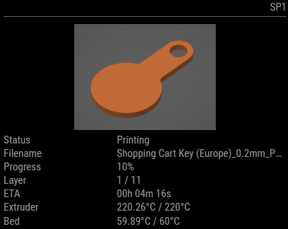

# MMM-moonraker

This is a module for the [MagicMirror²](https://github.com/MichMich/MagicMirror/).



This module will use the Moonraker API to show your current print status on your MagicMirror²! Moonraker is an API that is used by tools like Fluidd or Mainsail to manage your Klipper powered 3D printer with a web interface. The power of the same API is used to display printing related information on your MagicMirror².

## Installation

In your terminal, go to your MagicMirror's Module folder:

```bash
cd ~/MagicMirror/modules
```

Clone this repository:

```bash
git clone https://github.com/btastic/MMM-moonraker
```

## Using the module

To use this module, add the following configuration block to the modules array in the `config/config.js` file:
```js
var config = {
    modules: [
        {
            module: 'MMM-moonraker',
            position: 'top_right',
            config: {
                endpoint: "",
                updateInterval: 60000,
                showThumbnail: true,
                thumbnailSize: 150,
                hideDataOnStandby: true
            }
        }
    ]
}
```

## Layer count
To see the current layer and the total layer you have to setup your slicer to emit some G-code which will be interpreted by moonraker.
Check the Mainsail documentation on how to add layer information with your slicer: [Layer Count](https://docs.mainsail.xyz/overview/slicer/prusaslicer#layer-count)

## Customization
To change the color of the progress bar, you can override the default colors (green on gray) with css in your custom.css file.

You can also change the border radius of the progress bar, if you don't like rounded corners.

For example:
```css
.MMM-moonraker {
  --progress-color: crimson;
  --progress-background-color: gray;
  --border-radius: 0px;
}
```

## Configuration options

| Option               | Description
|--------------------- |-----------
| `endpoint`           | *Required* <br>Endpoint of the Moonraker API. Usually, this is the same as your Fluidd or Mainsail installation. For example: http://192.168.0.75<br><br>**Type:** `string`(url) 
| `updateInterval`     | *Optional* <br>The time interval between UI updates.<br><br>**Type:** `int`(milliseconds)<br>**Default:** 60000 milliseconds (60 seconds)
| `showThumbnail`      | *Optional* <br>Shows the largest thumbnail embedded in your gcode. Check the Mainsail documentation on how to add thumbnails with your slicer. [How to config your slicer for thumbnails](https://docs.mainsail.xyz/overview/features/thumbnails#how-to-config-your-slicer-for-thumbnails). Make sure to modify your config.js `address` to be something else than `0.0.0.0` or CORS will prevent you from showing the thumbnail. I use `localhost` and it is working fine.<br><br>**Type:** `bool` <br>**Default:** true
| `thumbnailSize`      | *Optional* <br>Changes with thumbnails size (width). Enter a integer value for an absolute value, or a relative size with % (e.g. "50%").<br><br>**Type:** `int\|string` <br>**Default:** 150
| `hideDataOnStandby`  | *Optional* <br>Hides printer info when the printer is on standby.<br><br>**Type:** `bool` <br>**Default:** true

## Available localizations
- English (en)
- German (de)